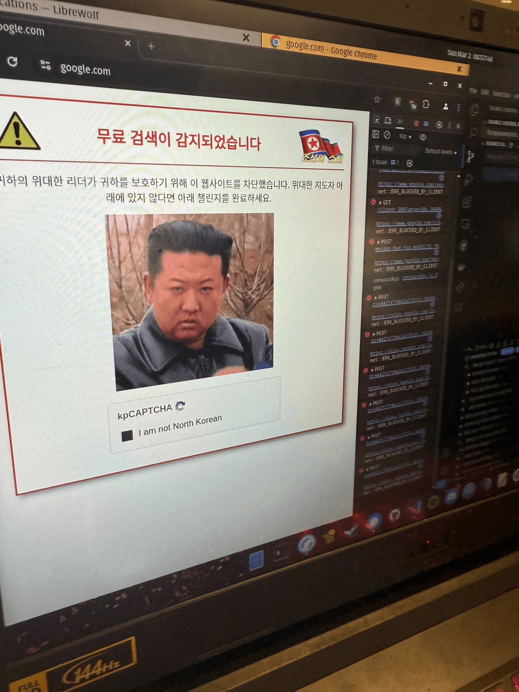

# Fuck You Website 

Browsing the web has become way too easy! So we set out to fix this and make it much more complicated.

This was a group project made for Hack Club Scrapyard Flagship with @3kh0, @NeonGamerBot-QK , @alexmen656

## Installing

1. Go to [the actions page](https://github.com/3kh0/fuckyouwebsite/actions/workflows/bundle.yml)
2. Click on the latest run and download the artifact at the bottom of the page.
3. Rename the file to remove the `.zip` at the end of the file name.